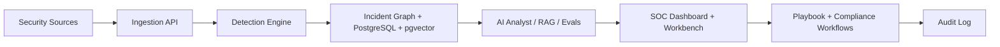

# Architecture

## System Overview

AegisSOC is organized into five layers:

1. Telemetry ingestion
2. Detection and anomaly scoring
3. Incident correlation and graph analysis
4. AI analyst, RAG retrieval, and evaluation layer
5. SOC dashboard, compliance evidence, and playbook workflows

## Security Sources

The current portfolio implementation simulates:

- Okta authentication events
- CloudTrail-style cloud audit logs
- Defender endpoint alerts
- VPC flow logs
- GitHub audit events
- Kubernetes workload security events

## Detection Engine

The platform has two detection layers:

- typed detection rules in the Next.js data model
- a FastAPI scoring service for anomaly-style events

The rules track:

- owner
- version
- MITRE ATT&CK technique
- tuning status
- test coverage
- precision
- recall
- false-positive rate
- deployable export formats

The `/api/detections/export` route emits a detection pack with Sigma-style rule JSON, Microsoft Sentinel KQL, and PostgreSQL hunting queries. That makes the rules usable outside the UI and closer to how SOC teams move detections between systems.

The FastAPI service scores events with feature inputs such as:

- failed login count
- geo-velocity
- outbound byte volume
- privilege delta

The scoring service uses an `IsolationForest` model to represent an anomaly-detection layer. A production version would replace or augment this with baselines per actor, asset, source, and time window.

## Incident Correlation

The correlation layer links incidents to:

- related security events
- identities
- assets
- matched detection rules
- business impact
- blast radius

The `/incidents/[id]` workbench presents this as an analyst handoff page. The `/api/correlation` route exposes the same data as JSON for downstream automation or reporting.

## AI Analyst Layer

The AI analyst route is structured around evidence-based responses:

- retrieve relevant incident data
- retrieve threat-intelligence notes
- map activity to MITRE ATT&CK
- recommend playbooks
- produce evidence and next actions
- run deterministic regression checks for expected signals

The current version avoids live API keys by using deterministic responses over local data. A production version would connect this to an LLM provider with strict prompt templates, citations, and policy gates.

The evaluation harness stores prompt cases, expected signals, risk area, and pass criteria. This is important because AI analyst behavior should be tested like software, not treated as an unmeasured chat experience.

## Data Model

The database schema includes:

- users and roles
- assets
- security events
- incidents
- threat notes with vector embeddings
- detection rules
- AI evaluation cases
- compliance controls
- incident graph edges
- playbooks
- playbook executions
- audit logs

This supports both analyst workflows and governance requirements.

## Compliance Evidence

The compliance center maps security operations evidence to:

- HIPAA audit controls
- HIPAA person or entity authentication
- SOC 2 system monitoring
- NIST CSF detection controls

The goal is to show that detections, incident handling, approval gates, and audit logs can produce evidence for regulated environments.

## Playbook Safety

Potentially disruptive actions require approval:

- identity session revocation
- service key disablement
- production containment

Safer actions can be automated:

- Kubernetes namespace quarantine
- evidence snapshots
- report generation

All playbook executions are designed to be written to an immutable audit log.
